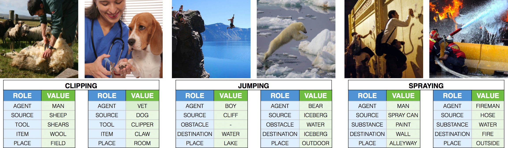

# group-fairness-metrics (Incomplete)

*Figure 1. Overview data format ImSitu dataset.*

For this assignment, you will be asked to apply a post-processing fairness method to the output of a binary classification model. To do so, you will need to write Python functions to calculate a set of group fairness metrics.

We have trained a binary classification model on a subset of the ImSitu dataset; depicting a man or woman (i.e., nouns: agents), who is either dusting or performing another activity (i.e., verb). The protected/sensitive attribute is gender, and for the sake of the exercise, we used the categories ‘Female' for the privileged group (i.e., overrepresented in the dataset), and ‘Male' for the unprivileged group (i.e., underrepresented in the dataset. In addition, the unfavorable/negative prediction is ‘dusting_no', and the favorable/positive prediction is ‘dusting_yes'.

In addition, we created two test sets:

49 images of men dusting, and 49 images of men performing another activity.
49 images of women dusting, and 49 images of women performing another activity.

To evaluate the fairness of the binary classification model, we created a confusion matrix for each test set; one for the male agent and another for the female agent.

If our binary classification model contains bias, then the outcomes of the group fairness metrics will be different for the two test sets. In practice, this means that the model will make biased predictions, which in turn may harm individuals or groups in society by instigating or facilitating an unfair decision-making process. For example, when we use our biased classifier to select images for an advertisement campaign, it may only select images of females dusting, thereby reinforcing the (harmful) stereotype that females are homemakers, and males are breadwinners.

To complete the assignment, you will need to:

- [ ] Set up the equations for the following group fairness metrics:
    - [ ] Demographic Parity
    - [ ] Predictive Parity
    - [ ] Equal Selection Parity
    - [ ] Conditional Use Accuracy Equality
    - [ ] Equalized Odds
    - [ ] Equalized Opportunities
    - [ ] Predictive Equality
- [ ] Write a separate Python function for each of the group fairness metrics that you defined above. Use the load_confusion_matrices(): function to load the confusion matrices for the protected/sensitive attribute test sets into the group fairness metrics. See calculate_metrics.py file, which is provided in the repository.
- [ ] Pass the unit tests listed in the test_calculate_metrics.py file, which is provided in your personal BUAs GitHub repository.